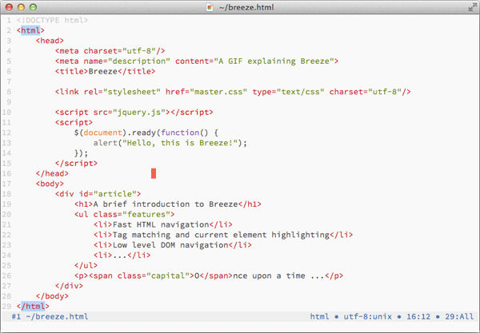
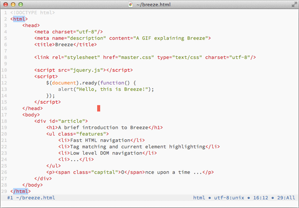

# breeze.vim

### Features
* HTML navigation inspired by vim-easymotion.
* Tag matching.
* Current element highlighting.
* Low level DOM navigation.

### Requirements
* Vim compiled with python 3.6+
* Linux, Mac, Windows

### Installation
The recommended way of installing the plugin is via 
[Vundle](https://github.com/gmarik/vundle), [Pathogen](https://github.com/tpope/vim-pathogen)
or [Neobundle](https://github.com/Shougo/neobundle.vim)

### Houston, we have a problem
For any functionality listed below, if it seems that something is not working
correctly (e.g. unresponsive commands), run the `BreezeWhatsWrong` command and
you will be shown the origin of the problem, usually something related to bad
formatted HTML.

## Tag jumping
   

As you can see this way of navigating the document is heavily inspired by
vim-easymotion. You can use the command `BreezeJumpF` to jump to following
tags and the `BreezeJumpB` command to jump to preceding tags.

When you run one of the aforementioned commands, Breeze displays
colored marks on the tags you can jump to and wait for your choice.
Once you have moved to a tag you can easily jump back using the `CTRL+O` 
vim mapping (:help CTRL+O). Note that when you are asked to insert the target
key you can exit the whole process pressing either `<ESC>` or `CTRL+C`.

## Tag matching and current element highlighting
   

By default Breeze highlights the opening and closing tags of the current
element. To turn off this functionality you can set
`g:breeze_highlight_curr_element` to 0. However, you always have at your
disposal the `BreezeHlElement` command to highlight the current element.

Another useful command is `BreezeMatchTag`. If the cursor is on an opening tag,
this command moves the cursor to the corresponding closing tag, and vice-versa.
If the command is called within an element, this command moves the cursor to
its opening tag. Remember that you can easily jump back to previous positions
with `CTRL+O`.

**Limitations:** At the moment current element highlighting is still
inefficient for large files and your movements may become quite slow when the
file is modified.

## DOM navigation
   

Commands for DOM navigation cover only low level movements at the moment but
might be useful for exploring dense HTML files. You can use commands
such as `BreezeNextSibling`, `BreezePrevSibling`, `BreezeFirstSibling`,
`BreezeLastSibling`, `BreezeFirstChild`, `BreezeLastChild` and `BreezeParent`.    

## Changelog
See [CHANGELOG.md](CHANGELOG.md).

## License
Copyright (c) 2013 Giacomo Comitti

Permission is hereby granted, free of charge, to any person obtaining a copy of
this software and associated documentation files (the "Software"), to deal in
the Software without restriction, including without limitation the rights to
use, copy, modify, merge, publish, distribute, sublicense, and/or sell copies
of the Software, and to permit persons to whom the Software is furnished to do
so, subject to the following conditions:

The above copyright notice and this permission notice shall be included in all
copies or substantial portions of the Software.

THE SOFTWARE IS PROVIDED "AS IS", WITHOUT WARRANTY OF ANY KIND, EXPRESS OR
IMPLIED, INCLUDING BUT NOT LIMITED TO THE WARRANTIES OF MERCHANTABILITY,
FITNESS FOR A PARTICULAR PURPOSE AND NONINFRINGEMENT. IN NO EVENT SHALL THE
AUTHORS OR COPYRIGHT HOLDERS BE LIABLE FOR ANY CLAIM, DAMAGES OR OTHER
LIABILITY, WHETHER IN AN ACTION OF CONTRACT, TORT OR OTHERWISE, ARISING FROM,
OUT OF OR IN CONNECTION WITH THE SOFTWARE OR THE USE OR OTHER DEALINGS IN THE
SOFTWARE.
